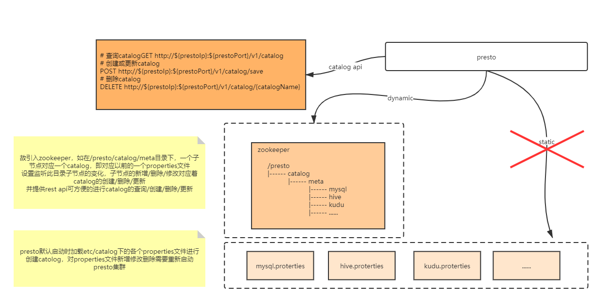

## data-audit-parent

### data-comparison

> 数据稽核架构图

[presto二次开发-动态catalog](https://github.com/thestyleofme/prestosql)

该项目需要[动态数据源(数据中台多数据源统一接口)](https://github.com/thestyleofme/plugin-driver-parent.git) 支持，可clone下来，按照说明文档进行打包，
放到此项目dist/plugin目录下，即${your_path}/data-audit-parent/dist/plugins/driver-xxx.jar

> 数据补偿

可基于生成的excel，使用[动态数据源(数据中台多数据源统一接口)](https://github.com/thestyleofme/plugin-driver-parent.git) 往不同数据源同步

也可基于生成的csv以及第三存储如phoenix，使用datax进行同步

### 开发文档

[开发文档详情](docs/start.md)

   

