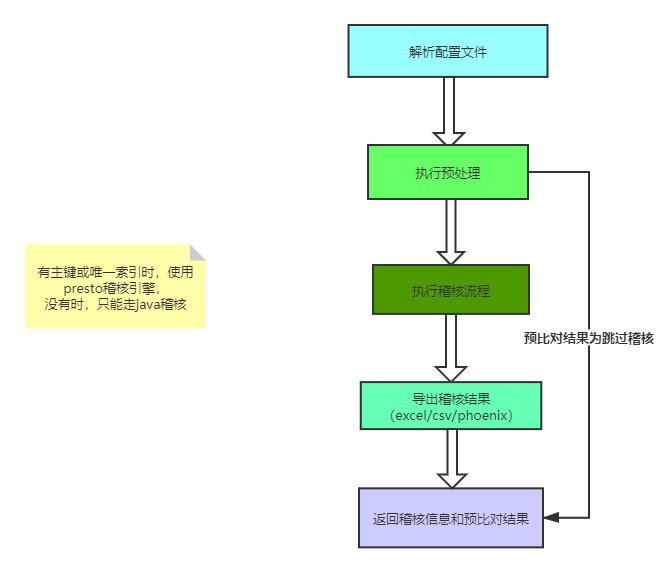

## 数据稽核--开发文档

---

#### 表设计

> xadt_comparison_job

| 列                | 类型     | 说明                                                         |
| ----------------- | -------- | ------------------------------------------------------------ |
| job_id            | bigint   | 任务id                                                       |
| job_code          | varchar  | 任务名称，英文数字下划线                                     |
| group_code        | varchar  | 任务组名称                                                   |
| job_desc          | varchar  | 任务描述                                                     |
| job_mode          | varchar  | 任务模式(OPTION:页面向导/IMPORT:脚本配置即自行编写配置文件或自行上传配置文件) |
| app_conf          | text     | 数据稽核任务json配置文件                                     |
| result_statistics | text     | 数据稽核结果统计                                             |
| start_time        | datetime | 任务执行开始时间                                             |
| status            | varchar  | 任务状态                                                     |
| error_msg         | text     | 错误信息                                                     |
| execute_time      | varchar  | 任务执行时长                                                 |

> xadt_comparison_job_group

| 列                     | 类型    | 说明                       |
| ---------------------- | ------- | -------------------------- |
| group_id               | bigint  | 任务组id                   |
| group_code             | varchar | 任务组名称，英文数字下划线 |
| group_desc             | varchar | 任务组描述                 |
| source_datasource_code | varchar | 源数据源                   |
| target_datasource_code | varchar | 目标数据源                 |
| source_schema          | varchar | 源库                       |
| source_where           | varchar | 库下所有来源表的过滤条件   |
| target_schema          | varchar | 目标库                     |
| target_where           | varchar | 库下所有目标表的过滤条件   |

> 表说明：

xadt_comparison_job是定义稽核任务中表级别数据的任务，也是数据稽核执行的最小单位

xadt_comparison_job_group是定义到数据库级别的配置，与xadt_comparison_job是头行关系

在配置时，xadt_comparison_job_group并不是必须的，只要有xadt_comparison_job，任务就可以执行

---

#### 数据稽核任务json配置

说明：xadt_comparison_job表的app_conf即为数据稽核任务的json配置文件

在执行数据稽核预处理、数据稽核、数据导出时都会使用到

##### json参数说明

> env：配置稽核要使用的数据源信息（数据源、表、库、主键/索引、字段映射等）
>
> preTransform：预处理信息配置
>
> transform：稽核引擎配置
>
> sink：数据导出方式配置

- source/target
    - 描述：源端或目标端信息配置
    - 参数
        - catalog：非必选，仅稽核引擎为presto时用到
        - dataSourceCode：非必选，与catalog二选一，平台数据源的DatasourceCode
        - schema：数据库名
        - table：表名
        - where：表级的where条件限制
        - globalWhere：库级别的where条件限制，来自xadt_comparison_job_group的target_where/source_where
    - 必选：是
- indexMapping
    - 描述：主键或唯一索引配置（对象数组）
        - sourceCol：源端字段
        - targetCol：目标端字段
    - 必选：否，推荐使用，加快稽核速度
- colMapping
    - 描述：源端与目标端所有字段的映射（对象数组）
        - sourceCol
        - targetCol
        - selected：是否是需要对比的字段，true/false
        - index：字段顺序
    - 必选：是
- preTransformType
    - 描述：预处理使用哪种方式进行（目前只有presto，仅在稽核引擎为presto时有效）
    - 必选：是
- skipCondition
    - 描述：预处理时，跳过稽核流程的条件，当条件都为true时，跳过稽核
    - 必选：否
- transform
    - 描述：配置稽核引擎，目前支持presto/java
        - presto
            - dataSourceCode：配置平台上的DataSourceCode
            - coordinatorUrl：presto的url，与dataSourceCode二选一，同时配置时，优先使用dataSourceCode
            - username：与coordinatorUrl搭配使用，访问presto的用户名
            - clusterCode：presto集群code，据此获取xadt_presto_cluster表中的DatasourceCode或url
        - java
            - 暂无内容配置
- sink
    - excel
        - 描述：excel导出稽核结果，内置的输出方式
        - outputPath ：配置excel导出路径，默认导出在{project}/excel/tenantId_jobCode.xlsx，推荐默认路径。非必选
    - csv
        - 描述：csv导出
        - path ：配置csv导出路径，默认导出在{project}/excel/tenantId_jobCode_type.xlsx，推荐默认路径。非必选
    - phoenix
        - 描述：导出到hbase中
        - jdbcUrl：phoenix连接url，必选

---

### 项目架构：

data-comparison-main (项目执行主模块，内置java稽核引擎)

data-comparison-common（通用工具模块，内置excel导出）

plugins（稽核模块插件）

--> phoenix（数据导出）

--> presto（数据稽核引擎）

--> csv（数据导出）

presto-catalog（二开的presto配置API）

#### 数据稽核流程

执行原则：

1. 优先执行任务组，批量异步执行任务组下的所有任务
2. 没有指定任务组时，异步执行单个任务

执行流程：

==> 解析配置文件

==> 执行预处理

==> 执行稽核流程

==> 导出稽核结果

==> 保存统计数据和预处理结果，更新任务状态



---

#### 预处理模块（preTransform）

> 当满足某些条件时，可以认为源端和目标端的数据是一致的，可以跳过稽核流程，因此先进行预比对处理，看是否需要继续执行后续稽核。

扩展方式：

com.github.thestyleofme.comparison.common.app.service.pretransform.BasePreTransformHook

实现该抽象接口下的方法，当skip方法为true时，将跳过后续的稽核流程，返回预比对结果，否则，仅保存预比对结果，继续执行稽核流程。

例：

```java

@Component
public class PrestoPreTransformHook extends BasePreTransformHook {

}
```

---

#### 稽核模块（transform）

> 该模块为稽核核心处理模块，对源端和目标端的数据的一致性进行分析，返回**仅源端有**、**仅目标端有**、**主键或唯一索引一致其他字段不一致**，这三种情况的差异性数据

目前已完成的模块：presto、java

com.github.thestyleofme.comparison.common.app.service.transform.BaseTransformHandler

扩展稽核引擎：

继承BaseTransformHandler接口，实现该接口中的handle方法，并在实现类上添加@TransformType和@Component标签

在任务执行时，根据json中transform模块中的配置信息，匹配TransformType中的值，选择对应的稽核引擎进行稽核流程。

例：

```java

@Component
@Slf4j
@TransformType(value = "PRESTO")
public class PrestoJobHandler implements BaseTransformHandler {

}
```

---

#### 数据导出模块（sink)

> 该模块将稽核的差异性数据导出到第三方进行存储，以便后续数据展示或数据补偿

目前支持的导出方式：excel（内置），csv，phoenix

扩展方式：

com.github.thestyleofme.comparison.common.app.service.sink.BaseSinkHandler

继承该接口，实现handle方法，添加@Component和@SinkType标签，执行时根据配置文件中sink模块的配置信息匹配SinkType标签中的值，选择对应的实现类进行处理。

例：

```java

@Component
@SinkType("CSV")
@Slf4j
public class CsvSinkHandler implements BaseSinkHandler {

}
```

---

#### 数据补偿

> 将**仅源端有**、**仅目标端有**、**主键或唯一索引一致其他字段不一致**，这三种差异性数据根据补偿策略，通过数据源或者datax补偿到源端

1. 基于数据源进行数据补偿（仅excel）

   com.github.thestyleofme.comparison.common.app.service.deploy.BaseDeployHandler

   继承该接口，实现handle方法，将导出到第三方的稽核结果根据补偿策略补偿到目标端，数据补偿时，需要依赖数据稽核任务的job信息

   例：

```java

@DeployType(CommonConstant.Deploy.EXCEL)
@Component
@Slf4j
public class ExcelDeployHandler implements BaseDeployHandler {

}
```

2. 基于datax进行数据补偿（csv、phoenix）

   主模块中有生成datax Reader的接口，该接口会调用BaseSinkHandler的dataxReader方法，根据sink配置生成不同的Datax Reader json配置

   扩展：

   com.github.thestyleofme.comparison.common.app.service.sink.BaseSinkHandler#dataxReader

   

